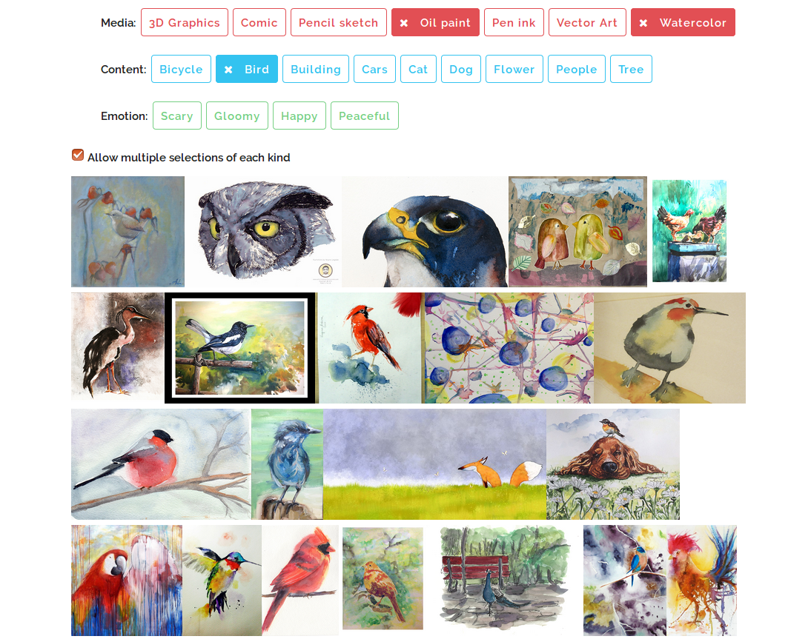
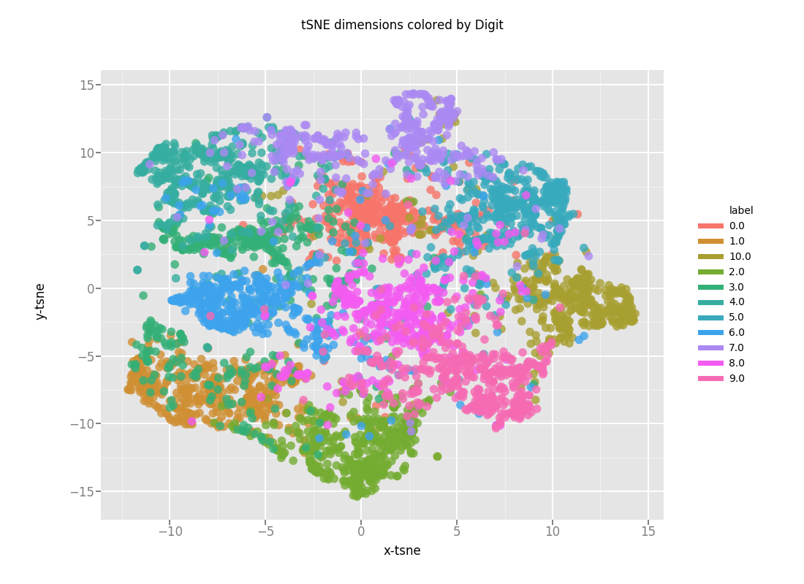
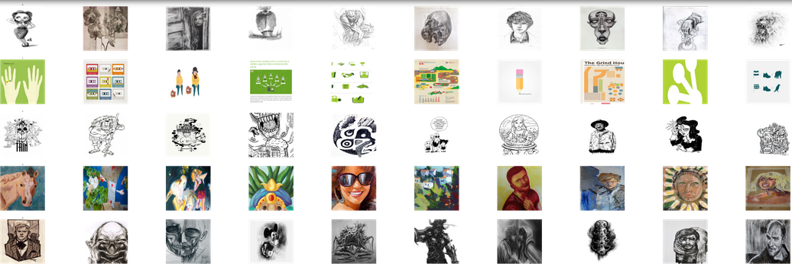
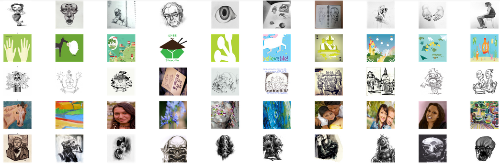

# Sketching-with-Style-ICCV-2017-PyTorch-
This is an un-official re-implementation of the work **[Sketching with Style presented](http://openaccess.thecvf.com/content_iccv_2017/html/Collomosse_Sketching_With_Style_ICCV_2017_paper.html)** at [ICCV 2017](http://iccv2017.thecvf.com/) by Prof. John Collomosse's Group and Adobe.

The current version of the code only includes the architecture models for the Style Representation Learning, till section 3.2.1 of the paper. (Although the code for the Content Representation Learning pipeline is also very similar and the code can be adapted to extend this very easily).

## Dependencies:

 * Python3
 * PyTorch (and other dependencies for PyTorch)
 * Numpy
 * OpenCV 3.3.0
 * Visdom Line Plotter
 * tqdm
 * cudnn (CUDA for training on GPU)

## Dataset:
 * The dataset used is a harvested subset of [BAM Dataset](https://bam-dataset.org/), which is equally distributed in style and content. (Although during harvesting, we were able to only achieve style balance, but not content balance.)
 * For more information on the dataset and how to harvest it, refer to Section 3.1 and 3.2.1 of the Paper.
 * The harvested dataset used in the Paper use 10,000 images for each Style, which results in 110,000 images. (We harvest 11,000 images for each style which results in 121,000 images. We try to make the harvested dataset as close to balanced in content as possible.)
 * To request access to the Dataset please visit the BAM website [here]((https://bam-dataset.org/).
 * For training of both the stages, we use a 80:10:10 split for Training, Validation and Testing as mentioned in the paper.

### A preview of the images in BAM Dataset:
<div align='center'>
    
</div>


## Training (Stage 1):
 * The training takes place in 2 stages. Stage 1 involves training a CNN (AlexNet used, which can be modified in the networks.py file) with Softmax classification loss (categorical cross-entropy) and Adam Optimizer.
 * There are 11 Style Classes in the [BAM Dataset](https://bam-dataset.org/) - 3D Graphics, Comic, Pencil Sketch, Oil Paint, Pen Ink, Vector Art, Water Color, Scary, Gloomy, Happy and Peaceful.
 * We train this CNN for 30 epochs (Hyperparameters: lr = 0.001, Adam optimizer, Categorical Cross-Entropy) (These are emperically chosen, not mentioned in the paper)
 * We stop this after 30 epochs and the weights are saved which are used later in Stage 2.
 * Python script for this part is classification_net.py

## Training (Stage 2):
 * Stage 2 of the pipeline, requries training a Triplet Convnet with Triplet Loss (MarginRanking loss)
 * For this we require an anchor image, a positive sample and a negative sample. (How these images are sampled is explained in section 3.2.1 of the Paper)
 * We train this triplet network for 50 epochs (Hyperparameters: lr = 0.001, SGD optimizer, MarginRanking Loss).
 * The model weights from Stage 1 are loaded before the training for Stage 2 is started.
 * Python script for this part is train.py
 * For more information on the Triplet Network and embedding networks, take a look at networks.py and triplet_network.py files.

### Note:
The bottle neck layer chosen has 256 dimensions (from experiments it was seen 256 dimensions instead of 128 makes not much difference in performance).

### Loss: 
<div align='center'>
    
</div>

### Triplet Network:
<div align='center'>
    
</div>

## t-sne Visualization for Learnt Embeddings.

### Tsne for Embeddings after Stage 1 Training is complete:
<div align='center'>
    
</div>

### Tsne for Embeddings after Stage 2 Training is complete:
<div align='center'>
    
</div>

## Retrieval Results:

### Retrieval Results after Stage 1:
<div align='center'>
    
</div>

### Retrieval Results after Stage 2:
<div align='center'>
    
</div>

## Running the Training Procedure:
 * For Stage 1, run `python classification.py`
 * For Stage 2, run `python train.py`
 * For details on the data-loader and data text files see next section.

## Data files in /data folder:
 * the classification_dataloader expects 2 files: filenames_filename and labels_filename.
 * filenames_filename => A text file with each line containing a path to an image, e.g., images/class1/sample.jpg
 * labels_filename => A text file with each line containing 1 integer, label index of the image.
 * Similarly the triplet_dataloader expects 2 files: filenames_filename and triplets_filename.
 * filenames_filename => A text file with each line containing a path to an image, e.g., images/class1/sample.jpg
 * triplets_filename => A text file with each line containing 3 integers, where integer i refers to the i-th image in filenames_filename. For a line with integers "a b c", a triplet is defined such that image a is more similar to image c than it is to image b.

## End-Notes and Disclaimer:
 * The bam dataset images have not been included.
 * The text files in the data folder are just for reference. They may vary according to your own data files.
 * To request access to the Dataset please visit the BAM website [here](https://bam-dataset.org/).
 * This implementation has not been verified by the original authors. Please use this at your own risk.
 * Feel free to use this code for your own work, but please cite the original authors if using this work officially.
 * In case of any bugs or errors, please be gracious enough to report an issue on this repo.

## To cite this work:
```
@InProceedings{Collomosse_2017_ICCV,
author = {Collomosse, John and Bui, Tu and Wilber, Michael J. and Fang, Chen and Jin, Hailin},
title = {Sketching With Style: Visual Search With Sketches and Aesthetic Context},
booktitle = {The IEEE International Conference on Computer Vision (ICCV)},
month = {Oct},
year = {2017}
} 
```


## License:
We distribute the source codes under the [MIT license](https://opensource.org/licenses/mit-license.php).
