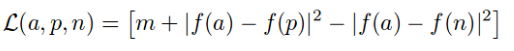
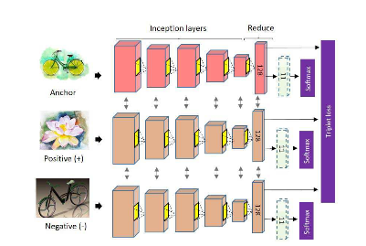

# Sketching-with-Style-ICCV-2017-PyTorch-
This is an un-official re-implementation of the work **[Sketching with Style presented](http://openaccess.thecvf.com/content_iccv_2017/html/Collomosse_Sketching_With_Style_ICCV_2017_paper.html)** at [ICCV 2017](http://iccv2017.thecvf.com/) by Prof. John Collomosse's Group and Adobe.

The current version of the code only includes the architecture models for the Style Representation Learning, till section 3.2.1 of the paper. (Although the code for the Content Representation Learning pipeline is also very similar and the code can be adapted to extend this very easily).

## Dependencies:

 * Python3
 * PyTorch (and other dependencies for PyTorch)
 * Numpy
 * OpenCV 3.3.0
 * Visdom Line Plotter
 * tqdm
 * cudnn (CUDA for training on GPU)

## Training (Stage 1):
 * The training takes place in 2 stages. Stage 1 involves training a CNN (AlexNet used, which can be modified in the networks.py file) with Softmax classification loss (categorical cross-entropy) and Adam Optimizer.
 * There are 11 Style Classes in the [BAM Dataset](https://bam-dataset.org/) - 3D Graphics, Comic, Pencil Sketch, Oil Paint, Pen Ink, Vector Art, Water Color, Scary, Gloomy, Happy and Peaceful.
 * We train this CNN for 30 epochs (Hyperparameters: lr = 0.001, Adam optimizer, Categorical Cross-Entropy) (These are emperically chosen, not mentioned in the paper)
 * We stop this after 30 epochs and the weights are saved which are used later in Stage 2.
 * Python script for this part is classification_net.py

## Training (Stage 2):
 * Stage 2 of the pipeline, requries training a Triplet Convnet with Triplet Loss (MarginRanking loss)
 * For this we require an anchor image, a positive sample and a negative sample. (How these images are sampled is explained in section 3.2.1 of the Paper)
 * We train this triplet network for 50 epochs (Hyperparameters: lr = 0.001, SGD optimizer, MarginRanking Loss).
 * The model weights from Stage 1 are loaded before the training for Stage 2 is started.
 * Python script for this part is train.py
 * For more information on the Triplet Network and embedding networks, take a look at networks.py and triplet_network.py files.

Loss: 

    

Triplet Network:

    

## License:
We distribute the source codes under the [MIT license](https://opensource.org/licenses/mit-license.php).
